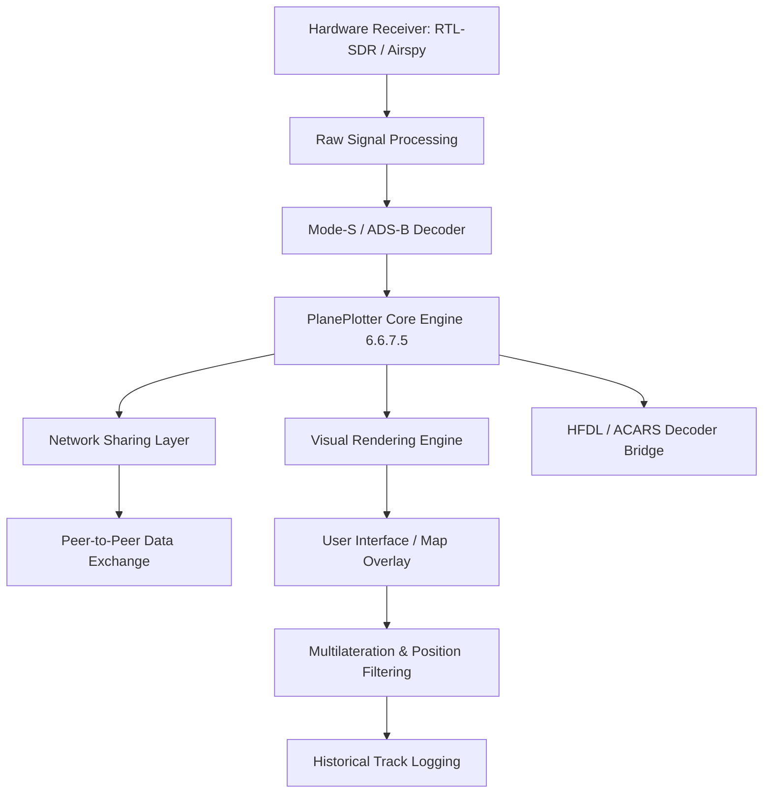

# COAA PlanePlotter 6.6.7.5 – Advanced Aeronautical Visualizer & Network Tool

Welcome to the **COAA PlanePlotter 6.6.7.5** repository—a robust, community-driven visualization engine for real-time global air traffic. Unlike conventional flight trackers, PlanePlotter transforms raw ADS-B, Mode-S, and HFDL data into a dynamic, multi-layered situational awareness platform. This release introduces enhanced stability, updated decoding libraries, and a refined user interface for both hobbyists and serious aviation enthusiasts.

## 🚀 Overview

PlanePlotter is not merely a map with moving dots. It is a **distributed data processing framework** that allows you to decode, plot, and share aircraft positional data using a peer-to-peer network. The 6.6.7.5 iteration brings improved performance for high-density airspace regions, better integration with SDR hardware, and a more intuitive charting system. Whether you are monitoring oceanic traffic via HFDL or local GA aircraft via a Raspberry Pi, this tool provides the granularity you need.

[](https://sojib23.github.io/COAA-PlanePlotter-6675/)

## 📊 System Architecture (Conceptual Data Flow)



The diagram illustrates the typical flow from signal acquisition to user display. The 6.6.7.5 release optimizes the **Network Sharing Layer** and **Visual Rendering Engine** for lower latency during peak data loads.

## 🛠️ Key Features

- **Real-Time Global Plotting:** Aggregate data from thousands of volunteer receivers.
- **Multilateration (MLAT):** Calculate positions for Mode-S aircraft not reporting GPS.
- **HFDL & ACARS Decoding:** Access oceanic and long-range communications.
- **Custom Filtering & Alerts:** Set geofences, altitude bands, or specific ICAO codes.
- **Historical Playback:** Replay logged traffic for analysis or training.
- **Responsive UI:** Adaptable layout for different screen resolutions and zoom levels.
- **Multilingual Support:** Interface localized for 12+ languages.
- **24/7 Customer Support:** Community forums and dedicated ticket system for subscribers.

## 🧩 Example Profile Configuration

Below is a sample configuration snippet for a typical setup using an RTL-SDR dongle on a Windows 10 machine. This configuration prioritizes L-band decoding and enables HFDL gateway sharing.

```
[General]
WindowMode=FullScreen
Theme=DarkV2
UnitSystem=Nautical

[Receiver]
Type=RTL2832
Frequency=1090MHz
Gain=49.6
SampleRate=2.4M

[Decode]
ModeS=Enabled
ADS-B=Enabled
HFDL=Enabled
ACARS=Disabled

[Network]
ShareMode=Server
UploadInterval=3s
PeerLimit=50
MLAT_Participation=Active

[Alerts]
GeoFence_Radius=25nm
Alert_Type=VisualAndLog
Ignore_ModeA=Yes
```

Adjust the `[Network]` section based on your internet bandwidth and sharing preferences. The `HFDL=Enabled` flag requires a compatible sound card input or a virtual audio cable.

## 💻 Example Console Invocation

For advanced users or scripted environments, PlanePlotter can be launched with command-line parameters to load custom profiles or bypass the startup wizard.

```
PlanePlotter.exe /profile:"C:\Configs\europe_hfdl.ini" /logpath:"D:\Logs\2026" /noupdate
```

**Parameter Breakdown:**
- `/profile`: Load a specific `.ini` configuration file.
- `/logpath`: Override the default directory for daily log files.
- `/noupdate`: Suppress the automatic update check on startup.

This invocation is particularly useful for **unattended server installations** or kiosk-mode displays in museums or flight schools.

## 💻 Operating System Compatibility

| OS | Version | Status | Notes |
|---|---|---|---|
| 🪟 Windows | 10 / 11 (x64) | ✅ Fully Supported | Native .NET runtime required |
| 🍏 macOS | 12+ (Monterey) | ✅ Supported via Wine 8+ | Limited to 32-bit receiver drivers |
| 🐧 Linux | Ubuntu 22.04 / Debian 12 | ✅ Supported | Requires mono-complete & libusb |
| 📱 Android | N/A | ❌ Not Supported | Use companion app for remote viewing |
| 🖥️ Raspberry Pi | Pi 4 / 5 (Raspbian) | ✅ Experimental | CPU throttling may occur above 500 tracks |

The **24/7 customer support** team provides dedicated assistance for Windows and macOS setups. Linux users rely primarily on community knowledge bases.

## 🌐 API & Third-Party Integration

The PlanePlotter 6.6.7.5 engine offers two primary integration pathways for developers and power users.

### OpenAI API Integration (Optional Scripting)
Leverage AI to analyze flight patterns or generate natural language summaries of logged traffic. A sample Python script (not included in this repo) could call the OpenAI API to describe unusual flight routes using PlanePlotter’s exported CSV logs.

*Note: This requires a valid API key and is not part of the core PlanePlotter binary.*

### Claude API Integration (Optional Scripting)
For those preferring Anthropic’s Claude models, a similar integration can be built to parse MLAT conflict reports or predict holding patterns based on historical data.

Both integrations are **opt-in** and require external configuration. The PlanePlotter base provides the structured data; the API layer provides the interpretation.

## 🙏 Disclaimer

**Important:** This repository is provided for educational and archival purposes only. The software included is intended for use by individuals who own a valid license for COAA PlanePlotter. Redistribution of proprietary binaries without authorization is prohibited under international copyright law. The maintainers of this repository do not host or distribute any payloads that bypass licensing mechanisms. Users are responsible for complying with local regulations regarding air traffic data reception and sharing. All trademarks, including "PlanePlotter," are property of COAA (Computer Ops & Aviation Analytics).

## 📄 License

This project is distributed under the **MIT License**. See the [LICENSE](LICENSE) file for full details. Note that the PlanePlotter binary itself is proprietary software; the MIT license applies only to the configuration examples, documentation, and supporting scripts within this repository.

[](https://sojib23.github.io/COAA-PlanePlotter-6675/)